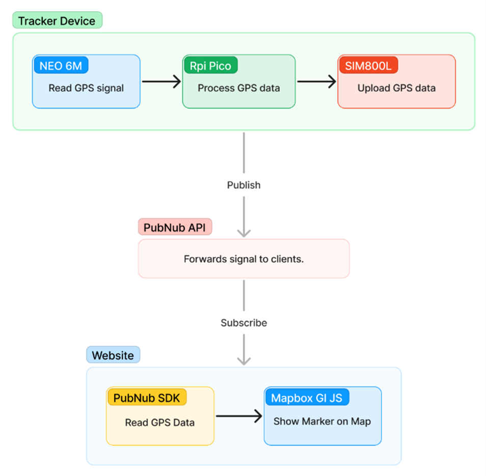

# Bus Tracker (Website)

Built on [OpenStreetMap](https://www.openstreetmap.org/about/) data and Mapbox Gl JS and PubNub

### Features -

-   Bus Routes
-   Live tracking
-   Last Location

## How it works?

## Tracking Device Hardware

-   Raspberrry Pi Pico
-   Neo 6M
-   SIM 800L

View device code [here](https://github.com/ssDhp/bt-Pico).
